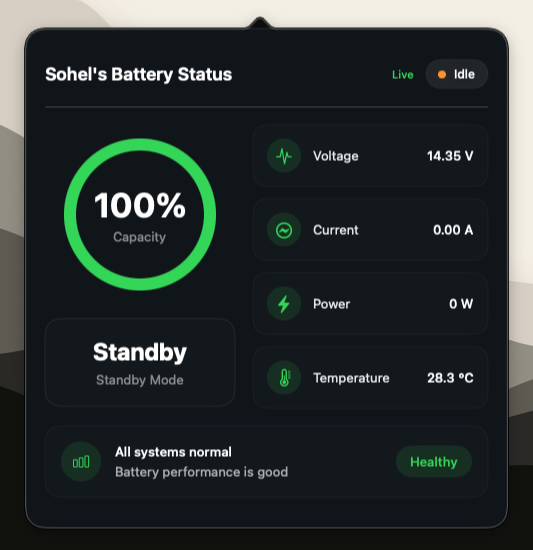

# BMS Monitor

A lightweight native macOS menu bar application for monitoring Battery Management System (BMS) data in real time using Firebase Realtime Database.
<p align="center">
  
</p>

---

## ✨ Features

- Native SwiftUI menu bar application
- Real-time battery monitoring
- Firebase Realtime Database integration
- Configurable `GoogleService-Info.plist`
- Custom database path support
- Battery notifications
- Smooth particle animation
- Apple-style settings interface

---


## 🚀 Installation

1. Clone the repository

```bash
git clone https://github.com/uixsohel/BMS-Monitor.git
```

2. Open the project in Xcode

3. Create a Firebase Realtime Database project

4. Download your `GoogleService-Info.plist`

5. Launch **BMS Monitor**

6. Import your Firebase configuration from **Settings**

---

## ⚙️ Requirements

- macOS 15+
- Xcode 16+
- Swift 6
- Firebase Realtime Database

---

## 🔥 Firebase Setup

The application does **not** include a Firebase configuration.

Each user should:

- Create their own Firebase project
- Download `GoogleService-Info.plist`
- Configure the app from **Settings**
- Enter their Realtime Database path

---

## 📄 License

MIT License
